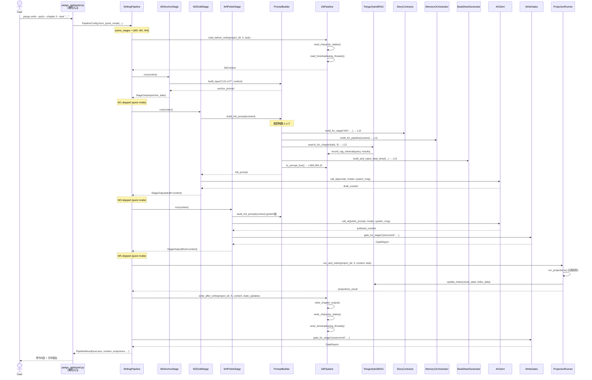
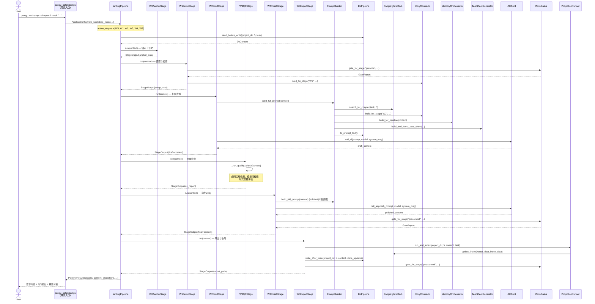
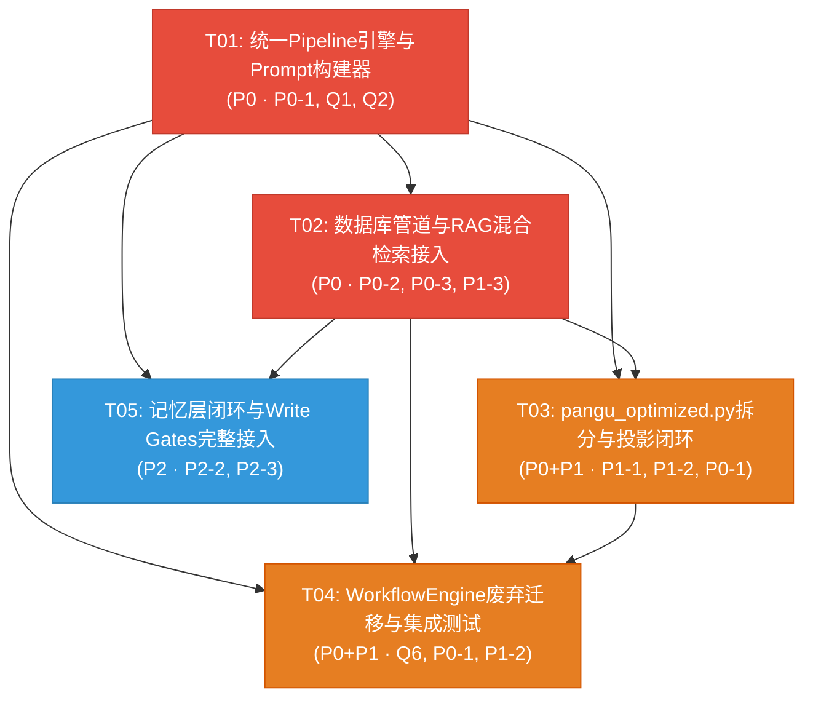

# 盘古AI系统架构优化 — 系统设计文档

> 版本：v1.0 | 日期：2026-06-11 | 架构师：高见远（Gao）

---

## Part A：系统设计

### 1. 实现方案

#### 1.1 核心技术挑战

| 挑战 | 难度 | 说明 |
|------|------|------|
| 双路径统一 | ★★★★ | `write_chapter_quick()`与`run_workflow_pipeline()`各有独立prompt构建、AI调用、状态更新逻辑，40%重复需合并为单一管线 |
| 17层Prompt注入链迁移 | ★★★★ | `build_smart_prompt()`的17层注入（L1-L17）需迁移到`pangu_core/prompts.py`作为唯一真值来源，同时适配WorkflowEngine的KnowledgeInjector |
| pangu_optimized.py拆分 | ★★★ | 2930行单文件拆为多模块，需保证CLI接口和所有功能不退化 |
| 模块接入闭环 | ★★★ | RAG/投影/合约/记忆/写门 5个已实现但未接入模块需安全集成到统一管线 |
| 数据库管道 | ★★ | 空表填充+写作前后读写，需与state.json更新逻辑对齐 |
| 投影-RAG闭环 | ★★ | 投影的VECTOR→FAISS、INDEX→BM25增量更新实现 |

#### 1.2 架构模式选择

**统一Pipeline + Stage架构**

保留并强化`workflow_engine.py`已有的Stage/Pipeline模式作为统一架构核心：

```
Pipeline(quick_mode)  →  W0 → [W1] → W2 → [W3] → W4 → [W5]
                         ✓     ✗      ✓     ✗      ✓     ✗    (快速模式)
                         ✓     ✓      ✓     ✓      ✓     ✓    (工坊模式)
```

- **快速模式** = Pipeline 仅执行 W0+W2+W4（跳过W1+W3），对应Q1决策
- **工坊模式** = Pipeline 执行全部 W0-W5
- 两种模式共享同一套 Stage 定义、prompt 注入链、AI 调用入口、状态更新逻辑

#### 1.3 框架与库选择

| 框架/库 | 版本 | 用途 | 选择理由 |
|---------|------|------|---------|
| Python | 3.10+ | 主语言 | 项目已有基础，无需更换 |
| dataclasses | stdlib | Stage/PipelineConfig定义 | 项目已使用，轻量够用 |
| FAISS | >=1.7 | 向量检索 | 已在rag_hybrid.py中使用 |
| jieba | >=0.42 | 中文分词(BM25) | 已在rag_hybrid.py中使用 |
| rank-bm25 | >=0.2 | BM25检索 | 已在rag_hybrid.py中使用 |
| sqlite3 | stdlib | 数据库 | 已在db.py中使用，WAL模式 |
| json | stdlib | 配置/状态文件 | 项目已有基础 |

**不引入新框架**：项目体量适中，dataclasses+函数式Pipeline已足够，无需引入LangChain等重型框架。

#### 1.4 架构核心决策

基于PRD的7个确认决策（Q1-Q7），本设计遵循：

| 决策编号 | 决策内容 | 设计影响 |
|---------|---------|---------|
| Q1 | 保留Stage/Pipeline模式 | 统一管线以Stage为原子单位，quick=跳过W1+W3 |
| Q2 | 17层prompt迁移到prompts.py | prompts.py成为唯一真值来源，KnowledgeInjector改为调用prompts.py |
| Q3 | 每次写作都读写DB | Stage前后插入DB读写hooks |
| Q4 | RAG top-K=5, rerank top-3 | L12层注入时固定参数 |
| Q5 | `_`函数拆分时更新跨模块引用 | 拆分计划中明确import映射 |
| Q6 | P0阶段增加集成测试 | 任务列表包含测试任务 |
| Q7 | 投影VECTOR→FAISS, INDEX→BM25 | W4后触发投影，投影结果更新检索索引 |

---

### 2. 文件列表

#### 2.1 新增文件

| 相对路径 | 职责 |
|---------|------|
| `pangu_core/pipeline.py` | 统一写作管线引擎：WritingPipeline、PipelineConfig、Stage注册与执行 |
| `pangu_core/stages.py` | 全部Stage定义（W0Anchor~W5Export），继承BaseStage |
| `pangu_core/prompt_builder.py` | 统一Prompt注入链（L1-L17），替代build_smart_prompt()和KnowledgeInjector |
| `pangu_core/db_pipeline.py` | 数据库管道：写作前读character_states/foreshadowing_threads，写作后写chapter_outputs等 |
| `pangu_core/project_manager.py` | 项目管理逻辑：从pangu_optimized.py拆出的项目初始化、状态读取、配置加载 |
| `pangu_core/chapter_writer.py` | 写作核心逻辑：从pangu_optimized.py拆出的单章/批量写作、状态更新 |
| `tests/test_unified_pipeline.py` | 统一管线集成测试 |
| `tests/test_db_pipeline.py` | 数据库管道集成测试 |

#### 2.2 修改文件

| 相对路径 | 修改内容 |
|---------|---------|
| `pangu_optimized.py` | 从2930行瘦身至≤300行，仅保留CLI入口+参数解析，调用pangu_core模块 |
| `workflow_engine.py` | 废弃原有独立管线，WritingPipeline取代之；保留Stage基类设计思想但迁移到stages.py |
| `pangu_core/prompts.py` | 从当前仅含SentenceParams/MODE_TO_GENRE，扩展为17层注入链的唯一真值来源 |
| `pangu_core/rag_hybrid.py` | 新增`search_for_chapter()`便捷方法，适配pipeline调用；新增增量索引更新接口 |
| `pangu_core/projection.py` | 新增`run_and_index()`方法，投影后自动更新FAISS和BM25索引 |
| `pangu_core/story_contracts.py` | 新增`build_for_stage()`方法，适配Stage粒度的合同构建 |
| `pangu_core/memory_layers.py` | 新增`build_for_pipeline()`方法，适配Pipeline粒度的记忆构建与提交 |
| `pangu_core/write_gates.py` | 新增`gate_for_stage()`方法，适配Stage粒度的关卡调用 |
| `pangu_core/db.py` | 扩展init_tables()，新增character_states/foreshadowing_threads/rag_retrievals/setting_constraints/knowledge_entries表 |
| `pangu_core/config.py` | 新增pipeline相关配置项（quick_mode_stages, workshop_mode_stages等） |
| `pangu_core/__init__.py` | 更新导出列表，新增pipeline/stages/prompt_builder/db_pipeline/project_manager/chapter_writer |

#### 2.3 废弃/删除

| 相对路径 | 说明 |
|---------|------|
| `workflow_engine.py`（原文件） | 被pangu_core/pipeline.py + pangu_core/stages.py取代，迁移后删除 |

---

### 3. 数据结构与接口

```mermaid
classDiagram
    direction TB

    class WritingPipeline {
        +PipelineConfig config
        +Dict~str,BaseStage~ stages
        +PipelineContext context
        +run() PipelineResult
        +register_stage(stage: BaseStage)
        +_execute_stage(stage_id: str) StageOutput
        +_should_skip(stage_id: str) bool
    }

    class PipelineConfig {
        +str mode
        +bool quick_mode
        +str project_dir
        +str mode_rule
        +str platform_rule
        +int chapter_num
        +str chapter_task
        +List~str~ active_stages
        +Dict stage_overrides
        +from_quick_mode(project_dir, chapter, task, mode, platform) PipelineConfig
        +from_workshop_mode(project_dir, chapter, task, mode, platform) PipelineConfig
    }

    class PipelineContext {
        +Dict~str,Any~ data
        +Dict~str,StageOutput~ stage_outputs
        +set(key: str, value: Any)
        +get(key: str, default: Any) Any
        +get_stage_output(stage_id: str) StageOutput
    }

    class PipelineResult {
        +bool success
        +str chapter_content
        +Dict~str,Any~ projections
        +Dict~str,Any~ db_records
        +List~str~ warnings
        +List~str~ errors
    }

    class BaseStage {
        <<abstract>>
        +str stage_id
        +str name
        +str input_schema
        +str output_schema
        +Dict knowledge_policy
        +run(context: PipelineContext) StageOutput
        +validate_input(context: PipelineContext) bool
        +validate_output(output: StageOutput) bool
    }

    class W0AnchorStage {
        +run(context: PipelineContext) StageOutput
        +_build_anchor_prompt(context) str
    }

    class W1SetupStage {
        +run(context: PipelineContext) StageOutput
        +_run_prewrite_gate(context) GateReport
    }

    class W2DraftStage {
        +run(context: PipelineContext) StageOutput
        +_call_ai_for_draft(context) str
    }

    class W3QCStage {
        +run(context: PipelineContext) StageOutput
        +_run_quality_check(context) QCResult
    }

    class W4PolishStage {
        +run(context: PipelineContext) StageOutput
        +_polish_draft(context) str
    }

    class W5ExportStage {
        +run(context: PipelineContext) StageOutput
        +_export_chapter(context) str
    }

    class StageOutput {
        +str stage_id
        +bool success
        +Dict~str,Any~ data
        +List~str~ warnings
        +List~str~ errors
    }

    class PromptBuilder {
        +Dict~str,str~ layers
        +build_full_prompt(context: PipelineContext) str
        +build_layer(layer_id: str, context: PipelineContext) str
        +inject_knowledge(context: PipelineContext) str
        +inject_contracts(context: PipelineContext) str
        +inject_memory(context: PipelineContext) str
        +inject_rag(context: PipelineContext) str
        +inject_beat_sheet(context: PipelineContext) str
        +inject_db_context(context: PipelineContext) str
        +_L01_system_role(ctx) str
        +_L02_mode_rules(ctx) str
        +_L03_platform_rules(ctx) str
        +_L04_style_guidance(ctx) str
        +_L05_sentence_params(ctx) str
        +_L06_reference_material(ctx) str
        +_L07_previous_summary(ctx) str
        +_L08_character_states(ctx) str
        +_L09_foreshadowing(ctx) str
        +_L10_story_contracts(ctx) str
        +_L11_memory_layers(ctx) str
        +_L12_rag_retrieval(ctx) str
        +_L13_beat_sheet(ctx) str
        +_L14_chapter_task(ctx) str
        +_L15_db_context(ctx) str
        +_L16_format_rules(ctx) str
        +_L17_final_wrap(ctx) str
    }

    class DbPipeline {
        +DatabaseManager db
        +read_before_write(project_dir: str, chapter: int, task: str) DbContext
        +write_after_write(project_dir: str, chapter: int, content: str, state_updates: Dict) None
        +read_character_states(project_dir: str) List~Dict~
        +read_foreshadowing_threads(project_dir: str) List~Dict~
        +write_chapter_output(project_dir: str, chapter: int, content: str) None
        +write_character_states(project_dir: str, updates: List~Dict~) None
        +write_foreshadowing_threads(project_dir: str, updates: List~Dict~) None
        +record_rag_retrieval(project_dir: str, query: str, results: List) None
    }

    class DbContext {
        +List~Dict~ character_states
        +List~Dict~ foreshadowing_threads
        +Dict~str,str~ settings_map
        +to_prompt_text() str
    }

    class PanguHybridRAG {
        +hybrid_search(query, top_k, vector_top_k, bm25_top_k, rerank_top_n) List~SearchResult~
        +search_for_chapter(task: str, chapter: int) List~SearchResult~
        +update_index(vector_data, index_data) None
    }

    class ProjectionRunner {
        +run_projections(project_dir, chapter_num, content, task, mode) Dict
        +run_and_index(project_dir, chapter_num, content, task, mode) Dict
    }

    class StoryContracts {
        +build_master_setting(project_dir, mode, platform) str
        +build_chapter_brief(project_dir, chapter, task, master_setting) str
        +build_for_stage(project_dir, stage_id, chapter, task, mode, platform) str
        +inject_contract_to_prompt(chapter_brief) str
    }

    class MemoryOrchestrator {
        +build_memory_pack(chapter, task_type) MemoryPack
        +build_for_pipeline(context: PipelineContext) MemoryPack
        +commit_memory(chapter, content, extraction) None
    }

    class WriteGates {
        +run_write_gate(project_dir, chapter, stage, content) GateReport
        +gate_for_stage(project_dir, chapter, stage_id, content) GateReport
    }

    class BeatSheetGenerator {
        +generate_beat_sheet(project_dir, chapter_num, task, mode, platform, call_ai_func, total_chapters) List~Dict~
        +inject_beat_sheet(state, chapter_num) str
        +build_and_inject_beat_sheet(project_dir, chapter, task, mode, platform) str
    }

    WritingPipeline *-- PipelineConfig : uses
    WritingPipeline *-- PipelineContext : creates
    WritingPipeline *-- PipelineResult : produces
    WritingPipeline o-- BaseStage : registers
    PipelineContext o-- StageOutput : stores

    BaseStage <|-- W0AnchorStage
    BaseStage <|-- W1SetupStage
    BaseStage <|-- W2DraftStage
    BaseStage <|-- W3QCStage
    BaseStage <|-- W4PolishStage
    BaseStage <|-- W5ExportStage

    W2DraftStage ..> PromptBuilder : builds prompt
    W4PolishStage ..> PromptBuilder : builds prompt
    W1SetupStage ..> WriteGates : prewrite gate
    W4PolishStage ..> WriteGates : precommit gate
    W5ExportStage ..> WriteGates : postcommit gate
    W4PolishStage ..> ProjectionRunner : post-write projection

    PromptBuilder ..> StoryContracts : L10
    PromptBuilder ..> MemoryOrchestrator : L11
    PromptBuilder ..> PanguHybridRAG : L12
    PromptBuilder ..> BeatSheetGenerator : L13
    PromptBuilder ..> DbPipeline : L08/L09/L15

    ProjectionRunner ..> PanguHybridRAG : update_index
    W2DraftStage ..> DbPipeline : read_before_write
    W5ExportStage ..> DbPipeline : write_after_write
```



---

### 4. 程序调用流程

#### 4.1 快速模式完整调用流



#### 4.2 工坊模式完整调用流



---

### 5. 不确定事项

| # | 事项 | 假设 | 风险 |
|---|------|------|------|
| 1 | `batch_generate()`是否也走统一Pipeline？ | 假设是——批量生成循环调用`WritingPipeline.run()`，每次一章 | 若batch有特殊状态管理需求需调整 |
| 2 | 17层prompt注入链中L06(参考材料)的来源 | 假设从`state.json`的`reference_material`字段读取 | 若参考材料有其他来源需扩展 |
| 3 | 投影的增量索引更新原子性 | 假设单章投影更新是追加式的，无需全局索引重建 | FAISS增量add有时需retrain |
| 4 | `creative_engine.db`的`writing_strategies`表 | P2优先级，本设计不涉及填充 | 不影响P0/P1 |
| 5 | 现有`unified_bridge.py`的角色 | 假设可忽略或P2阶段处理 | 若有活跃依赖需评估 |
| 6 | `writing_protocol.py`的角色 | 假设可忽略或P2阶段处理 | 同上 |
| 7 | W3(QC)的具体质检规则 | 假设沿用`write_gates.py`的`_check_content_quality()` | 可能需要扩展 |
| 8 | RAG检索失败降级策略 | 假设返回空列表，L12层跳过，其余层正常注入 | 已在PRD中确认 |

---

## Part B：任务分解

### 6. 依赖包

```
# 无新增依赖——所有依赖已在项目中使用
- faiss-cpu>=1.7.0: 向量检索（已有）
- jieba>=0.42.1: 中文分词（已有）
- rank-bm25>=0.2.2: BM25检索（已有）
- pytest>=7.0: 测试框架（已有或新增）
```

**说明**：本架构优化不引入新框架，所有pip依赖均已在`rag_hybrid.py`等模块中使用。唯一可能新增的是`pytest`（若项目尚未安装）。

---

### 7. 任务列表（按依赖排序）

#### T01：项目基础设施 — 统一Pipeline引擎 + Prompt构建器 + 配置扩展

| 字段 | 内容 |
|------|------|
| **Task ID** | T01 |
| **Task Name** | 统一Pipeline引擎与Prompt构建器 |
| **源文件** | `pangu_core/pipeline.py` (新增), `pangu_core/stages.py` (新增), `pangu_core/prompt_builder.py` (新增), `pangu_core/config.py` (修改), `pangu_core/prompts.py` (修改) |
| **依赖** | 无 |
| **优先级** | P0 |
| **对应PRD** | P0-1（双路径统一）, Q1, Q2 |
| **详细说明** | 1. 创建`pipeline.py`：实现WritingPipeline、PipelineConfig、PipelineContext、PipelineResult、StageOutput。PipelineConfig支持from_quick_mode()和from_workshop_mode()两种工厂方法。WritingPipeline.run()按active_stages顺序执行，跳过非active的Stage。<br/>2. 创建`stages.py`：实现BaseStage基类（stage_id, name, input_schema, output_schema, knowledge_policy, validate_input, validate_output, run）和6个具体Stage（W0AnchorStage~W5ExportStage）。W2DraftStage和W4PolishStage使用PromptBuilder构建prompt。<br/>3. 创建`prompt_builder.py`：将`build_smart_prompt()`的17层注入链和`KnowledgeInjector.inject()`合并为统一的PromptBuilder类，每层有独立的`_L0x()`方法。支持全量构建（build_full_prompt）和单层构建（build_layer）。<br/>4. 修改`config.py`：新增pipeline相关配置项（quick_mode_stages=["W0","W2","W4"], workshop_mode_stages=["W0","W1","W2","W3","W4","W5"], rag_top_k=5, rag_rerank_top_n=3）。<br/>5. 修改`prompts.py`：将当前KnowledgeInjector.inject()标记为deprecated，指向PromptBuilder。保留SentenceParams和MODE_TO_GENRE作为PromptBuilder的数据源。 |

#### T02：数据库管道 + RAG接入 + 模块适配层

| 字段 | 内容 |
|------|------|
| **Task ID** | T02 |
| **Task Name** | 数据库管道与RAG混合检索接入 |
| **源文件** | `pangu_core/db_pipeline.py` (新增), `pangu_core/db.py` (修改), `pangu_core/rag_hybrid.py` (修改), `pangu_core/story_contracts.py` (修改), `pangu_core/memory_layers.py` (修改), `pangu_core/write_gates.py` (修改) |
| **依赖** | T01 |
| **优先级** | P0 |
| **对应PRD** | P0-2（数据库管道）, P0-3（RAG接入）, P1-3（Story Contracts） |
| **详细说明** | 1. 创建`db_pipeline.py`：实现DbPipeline类和DbContext数据类。DbPipeline.read_before_write()读取character_states和foreshadowing_threads；write_after_write()写入chapter_outputs、character_states、foreshadowing_threads。DbContext.to_prompt_text()将数据库上下文转为可注入prompt的文本。<br/>2. 修改`db.py`：扩展init_tables()，新增5张表——character_states(id, project_dir, character_name, state_json, chapter_updated, timestamp)、foreshadowing_threads(id, project_dir, thread_id, description, status, planted_chapter, resolved_chapter, timestamp)、rag_retrievals(id, project_dir, chapter, query, results_json, scores_json, timestamp)、setting_constraints(id, project_dir, setting_key, setting_value, source, timestamp)、knowledge_entries(id, project_dir, title, content, tags, source_file, timestamp)。<br/>3. 修改`rag_hybrid.py`：新增search_for_chapter(task, chapter)便捷方法，内部调用hybrid_search(top_k=5, rerank_top_n=3)；新增update_index(vector_data, index_data)方法，支持投影后的增量索引更新。<br/>4. 修改`story_contracts.py`：新增build_for_stage(project_dir, stage_id, chapter, task, mode, platform)方法，根据stage_id决定构建哪层合同。<br/>5. 修改`memory_layers.py`：新增build_for_pipeline(context)方法，从PipelineContext提取必要信息构建记忆包。<br/>6. 修改`write_gates.py`：新增gate_for_stage(project_dir, chapter, stage_id, content)方法，根据stage_id映射到对应的关卡（W1→prewrite, W4→precommit, W5→postcommit）。 |

#### T03：入口薄壳化 + 投影接入 + 批量写作适配

| 字段 | 内容 |
|------|------|
| **Task ID** | T03 |
| **Task Name** | pangu_optimized.py拆分与投影闭环 |
| **源文件** | `pangu_optimized.py` (重写), `pangu_core/project_manager.py` (新增), `pangu_core/chapter_writer.py` (新增), `pangu_core/projection.py` (修改), `pangu_core/beat_sheet.py` (修改), `pangu_core/__init__.py` (修改) |
| **依赖** | T01, T02 |
| **优先级** | P0 + P1 |
| **对应PRD** | P1-1（投影接入）, P1-2（pangu_optimized.py拆分）, P0-1（双路径统一-入口衔接） |
| **详细说明** | 1. 创建`project_manager.py`：从pangu_optimized.py提取项目管理逻辑——项目初始化、state.json读写、配置加载、知识库路径管理。≤500行。<br/>2. 创建`chapter_writer.py`：从pangu_optimized.py提取写作编排逻辑——write_chapter()调用WritingPipeline、batch_generate()循环调用write_chapter()、状态更新调度。≤500行。<br/>3. 重写`pangu_optimized.py`为薄壳入口（≤300行）：仅保留CLI参数解析和命令分发，所有业务逻辑调用pangu_core模块。保留所有CLI命令和参数不变。<br/>4. 修改`projection.py`：新增run_and_index()方法，在run_projections()后自动调用RAG的update_index()将VECTOR路更新FAISS索引、INDEX路更新BM25语料，实现"写后索引→下次检索"闭环。<br/>5. 修改`beat_sheet.py`：新增适配Pipeline的方法，确保generate_beat_sheet()可被PromptBuilder的L13层调用。<br/>6. 修改`__init__.py`：更新导出列表，新增pipeline, stages, prompt_builder, db_pipeline, project_manager, chapter_writer。 |

#### T04：WorkflowEngine迁移 + 质量保障 + 集成测试

| 字段 | 内容 |
|------|------|
| **Task ID** | T04 |
| **Task Name** | WorkflowEngine废弃迁移与集成测试 |
| **源文件** | `workflow_engine.py` (废弃), `tests/test_unified_pipeline.py` (新增), `tests/test_db_pipeline.py` (新增), `pangu_core/stages.py` (修改), `pangu_core/pipeline.py` (修改) |
| **依赖** | T01, T02, T03 |
| **优先级** | P0 + P1 |
| **对应PRD** | P0-1（双路径统一-旧代码清理）, Q6（集成测试）, P1-2（拆分验证） |
| **详细说明** | 1. 废弃`workflow_engine.py`：确认所有调用方已迁移到WritingPipeline后删除。搜索项目中所有import workflow_engine的引用并更新。<br/>2. 补充`stages.py`和`pipeline.py`中可能遗漏的边界处理：Stage异常处理、Pipeline降级策略、Context数据流完整性校验。<br/>3. 创建`test_unified_pipeline.py`：测试快速模式仅执行W0+W2+W4；测试工坊模式执行全部6个Stage；测试两种模式对同一输入的prompt注入内容一致；测试Stage跳过逻辑；测试Pipeline异常时降级。<br/>4. 创建`test_db_pipeline.py`：测试read_before_write正确读取character_states和foreshadowing_threads；测试write_after_write正确写入3张表；测试RAG检索结果记录到rag_retrievals表；测试数据库操作失败时不阻断写作流程。<br/>5. 回归验证：确认所有现有CLI命令参数不变；确认build_smart_prompt()函数签名和返回值兼容；确认批量生成功能正常。 |

#### T05：记忆层闭环 + Write Gates完整接入 + 文档更新

| 字段 | 内容 |
|------|------|
| **Task ID** | T05 |
| **Task Name** | 记忆层闭环与Write Gates完整接入 |
| **源文件** | `pangu_core/memory_layers.py` (修改), `pangu_core/write_gates.py` (修改), `pangu_core/stages.py` (修改), `pangu_core/pipeline.py` (修改), `docs/architecture-design.md` (本文件) |
| **依赖** | T01, T02 |
| **优先级** | P2 |
| **对应PRD** | P2-2（记忆层深度集成）, P2-3（Write Gates完整接入） |
| **详细说明** | 1. 完善记忆层写入：写作后自动将章节内容提取为三层记忆条目（Working 45%/Episodic 30%/Semantic 25%），持久化到memory_bank.json和数据库。<br/>2. 完善记忆层读取：写作前按预算分配三层记忆条目注入prompt的L11层，实现记忆跨章节传递。<br/>3. Write Gates完整接入：W1前执行prewrite关卡、W4后执行precommit关卡、W5后执行postcommit关卡，blocker级别问题阻断流程。<br/>4. 在stages.py的对应Stage中插入gate调用点。<br/>5. 更新架构文档，记录最终实现的偏差和决策。 |

---

### 8. 共享知识

```
# 跨模块约定

## API/接口约定
- Pipeline中所有Stage的run()方法签名统一为: run(context: PipelineContext) -> StageOutput
- PipelineConfig工厂方法: from_quick_mode() / from_workshop_mode()
- PromptBuilder的17层注入链按L01-L17编号，每层独立方法_L0x(ctx) -> str
- 所有AI调用统一走 pangu_core/ai_client.py 的 call_ai()，不新增调用入口

## 数据库约定
- 所有数据库操作通过 pangu_core/db.py 的 DatabaseManager 执行
- 数据库路径: {project_dir}/novel_reference.db
- 表名采用snake_case，字段名采用snake_case
- 时间戳统一使用ISO 8601 UTC格式
- character_states.state_json 存储JSON字符串，读取时json.loads()

## Prompt注入链约定（L1-L17）
- L01: 系统角色 (system role)
- L02: 模式规则 (mode rules, from MODE_TO_GENRE)
- L03: 平台规则 (platform rules, from _PLATFORM_RULES)
- L04: 风格指引 (style guidance)
- L05: 句式参数 (sentence params, from SentenceParams)
- L06: 参考材料 (reference material)
- L07: 前文摘要 (previous summary)
- L08: 角色状态 (character states, from DB)
- L09: 伏笔线索 (foreshadowing threads, from DB)
- L10: 故事合约 (story contracts, from story_contracts.py)
- L11: 记忆层 (memory layers, from memory_layers.py)
- L12: RAG检索 (RAG retrieval, from rag_hybrid.py) [新增层]
- L13: 节拍表 (beat sheet, from beat_sheet.py)
- L14: 章节任务 (chapter task)
- L15: 数据库上下文 (DB context summary)
- L16: 格式规则 (format rules)
- L17: 最终包装 (final wrap)

## RAG约定
- 混合检索参数: top_k=5, vector_top_k=5, bm25_top_k=5, rerank_top_n=3
- RAG失败降级: 返回空列表，L12层跳过注入，不阻断写作
- 检索结果记录到 rag_retrievals 表

## 投影约定
- 五路投影: STATE/VECTOR/MEMORY/INDEX/EVENT
- 投影结果持久化到 {project_dir}/.projections/
- 单路失败不影响其他路和主流程
- VECTOR路更新FAISS索引，INDEX路更新BM25语料（闭环）

## 命名约定
- Stage类命名: W{N}{Name}Stage (如 W0AnchorStage)
- Stage ID: "W0", "W1", ..., "W5"
- 快速模式active_stages: ["W0", "W2", "W4"]
- 工坊模式active_stages: ["W0", "W1", "W2", "W3", "W4", "W5"]

## 兼容性约定
- build_smart_prompt() 保留原函数签名，内部委托给 PromptBuilder
- write_chapter_quick() 保留原函数签名，内部调用 WritingPipeline
- 所有CLI命令和参数不变
- state.json 读写逻辑不变
```

---

### 9. 任务依赖图



**图例**：红色=P0，橙色=P0+P1，蓝色=P2

**关键路径**：T01 → T02 → T03 → T04（必须顺序执行，构成P0+P1的完整交付）

**可并行路径**：T05仅依赖T01+T02，可在T03/T04开发期间并行推进（P2优先级允许延后）

---

## 附录：Stage与PRD需求的映射矩阵

| Stage | 快速模式 | 工坊模式 | 涉及PRD需求 | 接入模块 |
|-------|---------|---------|-------------|---------|
| W0 Anchor | ✓ | ✓ | P0-1 | — |
| W1 Setup | ✗ | ✓ | P1-3, P2-3 | WriteGates(prewrite), StoryContracts |
| W2 Draft | ✓ | ✓ | P0-1, P0-2, P0-3, P1-3 | PromptBuilder, DbPipeline(read), RAG, Contracts, Memory, BeatSheet |
| W3 QC | ✗ | ✓ | P1-3 | WriteGates, StoryContracts(违约检测) |
| W4 Polish | ✓ | ✓ | P0-1, P1-1, P2-3 | PromptBuilder, WriteGates(precommit), ProjectionRunner |
| W5 Export | ✗ | ✓ | P0-2, P2-2, P2-3 | DbPipeline(write), WriteGates(postcommit), MemoryOrchestrator(commit) |

**特殊说明**：
- 快速模式下W4后也需要执行投影和数据库写入（不在W5中，因为没有W5），这部分逻辑由WritingPipeline在W4完成后自动触发
- 工坊模式下投影和DB写入在W5中执行
- 这通过PipelineConfig中的post_stage_hooks配置实现
