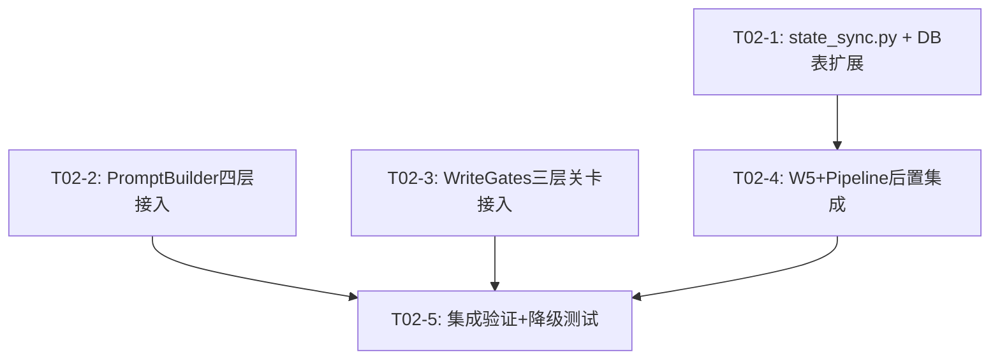
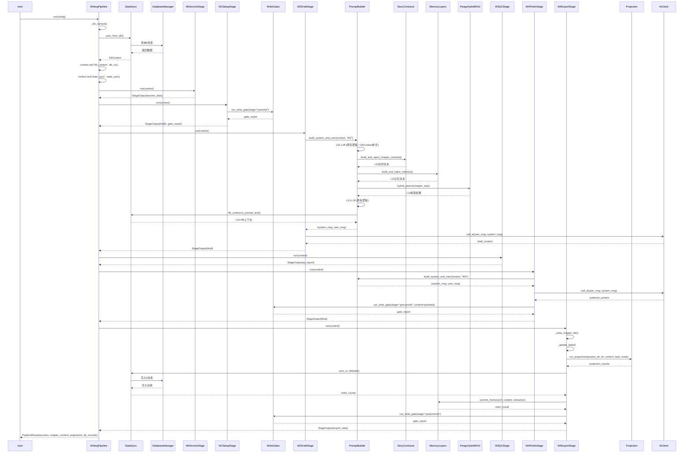
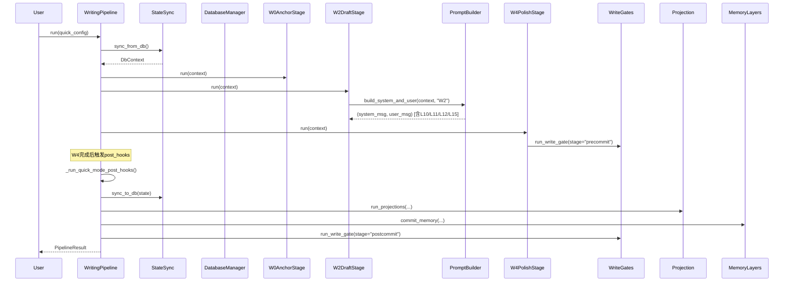

# T02 架构设计：6模块管道打通集成方案

> 作者：架构师 高见远  
> 日期：2025-07  
> 状态：待工程师实现

---

## 目录

1. [实现方案](#1-实现方案)
2. [文件修改清单](#2-文件修改清单)
3. [任务列表](#3-任务列表)
4. [数据流图](#4-数据流图)
5. [共享知识/跨文件约定](#5-共享知识跨文件约定)
6. [风险点和待明确事项](#6-风险点和待明确事项)

---

## 1. 实现方案

### 1.1 总体策略

T02的核心目标是将6个已实现但未接入的模块"插入"T01已验证的Pipeline/Stages/PromptBuilder三条主线的预留位置。具体策略：

- **Pipeline层面**：填充 `_run_quick_mode_post_hooks()` 中的3个TODO，让快速模式W4后自动触发投影+DB写入+postcommit gate
- **Stages层面**：填充W1(prewrite gate)、W4(precommit gate)、W5(DB写入+投影+postcommit gate)中的TODO
- **PromptBuilder层面**：填充L10(故事合约)、L11(记忆层)、L12(RAG检索)、L15(DB上下文)4个返回空字符串的TODO
- **新建state_sync.py**：实现state.json→数据库双向同步，激活5张空表

### 1.2 各模块接入方案

#### 1.2.1 WriteGates — 三层关卡接入

**已有接口**：
```python
# write_gates.py
def run_write_gate(project_dir, *, chapter, stage, content="") -> Dict[str, Any]
# stage: "prewrite" | "precommit" | "postcommit"
# 返回: {"ok": bool, "errors": [...], "warnings": [...], "details": {...}}
```

**接入点**：

| 关卡 | 接入位置 | 文件 | 原有TODO标记 |
|------|---------|------|-------------|
| prewrite | `W1SetupStage.run()` 开头 | stages.py L236 | `TODO: T02 - 调用 WriteGates.gate_for_stage(project_dir, chapter_num, "W1", "")` |
| precommit | `W4PolishStage.run()` 结尾 | stages.py L608 | `TODO: T02 - 调用 WriteGates.gate_for_stage(project_dir, chapter_num, "W4", polished_content)` |
| postcommit | `W5ExportStage.run()` 结尾 | stages.py L716 | `TODO: T02 - 调用 WriteGates.gate_for_stage(project_dir, chapter_num, "W5", final_content)` |
| postcommit(快速模式) | `WritingPipeline._run_quick_mode_post_hooks()` | pipeline.py L434 | `TODO: T02 - 调用 WriteGates.gate_for_stage` |

**接入方式**：
- 使用延迟导入 `from .write_gates import run_write_gate`
- 包裹在 try/except ImportError 中实现降级
- blocker级错误阻断流程，warning级错误记录后继续
- 关卡报告写入 `context.set("gate_report_{stage}", report)` 供后续Stage读取

**关键适配**：write_gates.py的 `run_write_gate` 使用 `stage="prewrite"/"precommit"/"postcommit"` 命名，而Pipeline使用 `"W1"/"W4"/"W5"` 命名，需要做映射：
```
W1 → prewrite
W4 → precommit  
W5 → postcommit
```

#### 1.2.2 RAG混合检索接入

**已有接口**：
```python
# rag_hybrid.py
class PanguHybridRAG:
    def __init__(self, knowledge_dir: Path, use_rerank: bool = True)
    def initialize(self, documents: List[Dict]) -> None
    async def hybrid_search(self, query, top_k=10, ...) -> List[SearchResult]

def create_hybrid_rag(knowledge_dir: Path, use_rerank: bool = True) -> PanguHybridRAG
```

**接入点**：
- PromptBuilder `_L12_rag_retrieval()` (prompt_builder.py L732)

**接入方式**：
- `_L12_rag_retrieval()` 中调用 `PanguHybridRAG.hybrid_search()` 或同步包装
- 由于 `hybrid_search` 是 async 方法，需要提供同步包装器或使用 `asyncio.run()`
- 检索结果格式化为Prompt注入文本：top 3结果的content摘要
- RAG实例缓存在context中避免重复初始化：`context.set("rag_instance", rag)`

**降级策略**：
- ImportError → 返回空字符串（当前行为）
- 检索无结果 → 返回空字符串
- API失败 → 记录warning，返回空字符串

#### 1.2.3 投影模块接入

**已有接口**：
```python
# projection.py
def run_projections(project_dir, chapter_num, chapter_content, chapter_task="", mode="general") -> Dict[str, Any]
# 返回: {"state": {"applied": bool, "detail": str}, "vector": ..., "memory": ..., "index": ..., "event": ...}
```

**接入点**：

| 位置 | 文件 | 说明 |
|------|------|------|
| W5ExportStage.run() 步骤5 | stages.py L712 | `TODO: T02 - 调用 ProjectionRunner.run_and_index()` |
| WritingPipeline._run_quick_mode_post_hooks() | pipeline.py L429 | `TODO: T02 - 调用 ProjectionRunner.run_and_index()` |

**接入方式**：
- 直接调用 `run_projections(project_dir, chapter_num, chapter_content, chapter_task, mode)`
- 结果写入context：`context.set("projections", projection_results)`
- PipelineResult.projections 从context读取

**注意事项**：
- projection.py的STATE投影会更新state.json，但W5ExportStage._update_state()也会更新state.json
- 需要确保执行顺序：先_update_state()写state.json → 再run_projections()读并追加更新
- 或者在projection的STATE投影中跳过与_update_state重复的逻辑

#### 1.2.4 StoryContracts接入

**已有接口**：
```python
# story_contracts.py
def build_and_inject_chapter_contract(project_dir, chapter, chapter_task="", mode="", platform="") -> str
def build_master_setting(project_dir, mode="", platform="") -> Dict[str, Any]
def build_chapter_brief(project_dir, chapter, chapter_task="", master_setting=None) -> Dict[str, Any]
def inject_contract_to_prompt(chapter_brief) -> str
```

**接入点**：
- PromptBuilder `_L10_story_contracts()` (prompt_builder.py L681)

**接入方式**：
- 调用 `build_and_inject_chapter_contract()`，一站式构建+持久化+返回注入文本
- 参数从context获取：`project_dir`, `chapter_num`, `chapter_task`, `mode_name`, `platform_name`

**降级策略**：
- ImportError → 返回空字符串
- state.json不存在 → build_master_setting返回空合同 → inject_contract_to_prompt返回空字符串

#### 1.2.5 MemoryLayers接入

**已有接口**：
```python
# memory_layers.py
class PanguMemoryOrchestrator:
    def __init__(self, project_dir: Path)
    def build_memory_pack(self, chapter, task_type="write") -> Dict[str, Any]
    def commit_memory(self, chapter, content, extraction=None) -> Dict[str, Any]

def build_and_inject_memory(project_dir, chapter, task_type="write") -> str
def build_memory_injection(memory_pack) -> str
```

**接入点**：

| 位置 | 文件 | 说明 |
|------|------|------|
| PromptBuilder `_L11_memory_layers()` | prompt_builder.py L707 | 构建记忆包注入Prompt |
| W5ExportStage.run() | stages.py | 章节完成后commit_memory()写入新记忆项 |

**接入方式**：

**读取侧（Prompt注入）**：
- `_L11_memory_layers()` 调用 `build_and_inject_memory(project_dir, chapter_num)`
- 返回格式化的记忆注入文本

**写入侧（记忆提交）**：
- W5中章节写入后，调用 `PanguMemoryOrchestrator.commit_memory(chapter_num, final_content, extraction)`
- extraction数据来自W5._update_state()提取的伏笔/角色/设定信息
- 快速模式下在 `_run_quick_mode_post_hooks()` 中调用

#### 1.2.6 state_sync.py — 新建模块

**目标**：实现state.json与数据库的双向同步，激活5张空表

**5张空表定义**：
```sql
character_states     -- 角色状态表（name, role, current_state, location, last_chapter, updated_at）
foreshadowing_threads -- 伏笔线索表（id, description, status, planted_ch, resolved_ch, priority）
setting_constraints  -- 设定约束表（id, rule, category, status, source_chapter, locked_at）
knowledge_entries    -- 知识词条表（id, name, category, content, triggers, priority）
ref_chapters         -- 参考章节表（id, project_name, chapter_num, title, content, word_count, summary）
```

**核心接口**：
```python
class StateSync:
    def __init__(self, project_dir: str, db: DatabaseManager)
    def sync_to_db(self, state: Dict) -> Dict[str, int]  # state.json → DB，返回各表写入行数
    def sync_from_db(self) -> Dict                        # DB → state.json，返回合并后的state
    def get_db_context(self, chapter: int) -> DbContext   # 供PromptBuilder L15使用的上下文
```

**DbContext类**：
```python
@dataclass
class DbContext:
    character_states: List[Dict]    # 当前活跃角色状态
    foreshadowing_threads: List[Dict]  # 活跃伏笔
    setting_constraints: List[Dict]    # 锁定设定规则
    knowledge_entries: List[Dict]      # 相关知识词条
    ref_chapters: List[Dict]           # 近期参考章节
    
    def to_prompt_text(self) -> str:   # 格式化为Prompt文本
```

**接入点**：

| 位置 | 文件 | 说明 |
|------|------|------|
| Pipeline._init_context() | pipeline.py L240 | 初始化时从DB读取context：`context.set("db_context", db_ctx)` |
| PromptBuilder._L08_character_states() | prompt_builder.py L607 | 从DbContext读取角色状态（补充state.json） |
| PromptBuilder._L09_foreshadowing() | prompt_builder.py L667 | 从DbContext读取伏笔线索（补充state.json） |
| PromptBuilder._L15_db_context() | prompt_builder.py L887 | 从DbContext.to_prompt_text()获取DB上下文 |
| W5ExportStage.run() | stages.py L708 | 章节完成后sync_to_db() |
| WritingPipeline._run_quick_mode_post_hooks() | pipeline.py L424 | 快速模式下sync_to_db() |

### 1.3 执行顺序总览

```
Pipeline启动 → _init_context()
  ├─ 加载state.json
  ├─ 加载前文上下文
  └─ [T02新增] StateSync.sync_from_db() → context.set("db_context", db_ctx)

W0.run() — 无T02改动
  
W1.run() — [T02新增] prewrite gate
  └─ run_write_gate(stage="prewrite")

W2.run() — PromptBuilder使用17层Prompt
  ├─ L08: [T02新增] DbContext.character_states 补充
  ├─ L09: [T02新增] DbContext.foreshadowing_threads 补充
  ├─ L10: [T02新增] build_and_inject_chapter_contract()
  ├─ L11: [T02新增] build_and_inject_memory()
  ├─ L12: [T02新增] PanguHybridRAG.hybrid_search()
  └─ L15: [T02新增] DbContext.to_prompt_text()

W3.run() — 无T02改动

W4.run() — [T02新增] precommit gate
  └─ run_write_gate(stage="precommit")

W5.run() — [T02新增] DB写入 + 投影 + 记忆提交 + postcommit gate
  ├─ run_projections()  → 五路投影
  ├─ StateSync.sync_to_db()  → state.json → DB
  ├─ MemoryOrchestrator.commit_memory()  → 记忆写入
  └─ run_write_gate(stage="postcommit")

快速模式hooks (_run_quick_mode_post_hooks)
  ├─ StateSync.sync_to_db()
  ├─ run_projections()
  ├─ MemoryOrchestrator.commit_memory()
  └─ run_write_gate(stage="postcommit")
```

---

## 2. 文件修改清单

### 2.1 新建文件

| 文件 | 说明 |
|------|------|
| `pangu_core/state_sync.py` | state.json↔DB双向同步，DbContext，5张空表激活 |

### 2.2 修改文件

| 文件 | 修改概要 |
|------|---------|
| `pangu_core/pipeline.py` | ① `_init_context()` 增加StateSync初始化 ② `_run_quick_mode_post_hooks()` 填充3个TODO |
| `pangu_core/stages.py` | ① W1.run() 填充prewrite gate TODO ② W4.run() 填充precommit gate TODO ③ W5.run() 填充DB写入+投影+postcommit gate TODO + 记忆提交 |
| `pangu_core/prompt_builder.py` | ① _L08_character_states() 补充DbContext数据 ② _L09_foreshadowing() 补充DbContext数据 ③ _L10_story_contracts() 接入StoryContracts ④ _L11_memory_layers() 接入MemoryLayers ⑤ _L12_rag_retrieval() 接入PanguHybridRAG ⑥ _L15_db_context() 接入DbContext |
| `pangu_core/db.py` | ① init_tables() 增加5张新表DDL ② 新增get_mode()/get_platform()兼容方法 |
| `pangu_core/config.py` | 无修改（PIPELINE_CONFIG已有write_gates_enabled/projection_enabled配置） |

### 2.3 各文件详细修改内容

#### pipeline.py 修改详情

**修改1：`_init_context()` 增加StateSync初始化**

位置：L240 `self.context.set("db_context", None)` 替换为：

```python
# T02: StateSync初始化
try:
    from .state_sync import StateSync
    from .db import get_db
    db = get_db()
    state_sync = StateSync(project_dir, db)
    db_ctx = state_sync.sync_from_db()
    self.context.set("db_context", db_ctx)
    self.context.set("state_sync", state_sync)
except ImportError:
    self.context.set("db_context", None)
    self.context.set("state_sync", None)
except Exception as e:
    print(f"[Pipeline] StateSync初始化失败(降级): {e}")
    self.context.set("db_context", None)
    self.context.set("state_sync", None)
```

**修改2：`_run_quick_mode_post_hooks()` 填充3个TODO**

替换L424-L436的3个TODO：

```python
# 1. DB写入
try:
    state_sync = self.context.get("state_sync")
    if state_sync:
        state = self.context.get("state", {})
        write_counts = state_sync.sync_to_db(state)
        self.context.set("db_records", write_counts)
        print(f"  [hook] DB写入: {write_counts}")
except Exception as e:
    warnings.append(f"DB写入失败(降级): {e}")

# 2. 投影
try:
    from .projection import run_projections
    chapter_task = self.config.chapter_task
    mode_name = self.context.get("mode_name", "general")
    projections = run_projections(project_dir, chapter_num, chapter_content, chapter_task, mode_name)
    self.context.set("projections", projections)
    print(f"  [hook] 投影完成: {sum(1 for v in projections.values() if v.get('applied'))}/5路")
except ImportError:
    warnings.append("projection模块不可用，跳过投影")
except Exception as e:
    warnings.append(f"投影执行失败(降级): {e}")

# 3. 记忆提交
try:
    from .memory_layers import PanguMemoryOrchestrator
    orchestrator = PanguMemoryOrchestrator(Path(project_dir))
    orchestrator.commit_memory(chapter_num, chapter_content)
    print(f"  [hook] 记忆已提交")
except ImportError:
    pass  # 记忆模块不可用，不影响核心流程
except Exception as e:
    warnings.append(f"记忆提交失败(降级): {e}")

# 4. postcommit gate
try:
    from .write_gates import run_write_gate
    gate_report = run_write_gate(project_dir, chapter=chapter_num, stage="postcommit")
    if gate_report and not gate_report.get("ok", True):
        gate_errors = [e for e in gate_report.get("errors", []) if e.get("severity") == "blocker"]
        if gate_errors:
            errors.append(f"postcommit关卡阻断: {gate_errors[0].get('message', '')}")
    print(f"  [hook] postcommit gate: {'OK' if gate_report.get('ok', True) else 'FAIL'}")
except ImportError:
    pass  # write_gates不可用，跳过
```

#### stages.py 修改详情

**W1.run() 填充prewrite gate TODO**（L235-L247）

替换注释块为：
```python
try:
    from .write_gates import run_write_gate
    gate_report = run_write_gate(project_dir, chapter=chapter_num, stage="prewrite")
    if gate_report and not gate_report.get("ok", True):
        blocker_errors = [e for e in gate_report.get("errors", [])
                         if e.get("severity") == "blocker"]
        if blocker_errors:
            gate_passed = False
            warnings.append(f"prewrite关卡阻断: {blocker_errors[0].get('message', '')}")
    context.set("gate_report_prewrite", gate_report)
except ImportError:
    warnings.append("write_gates不可用，跳过prewrite关卡")
```

**W4.run() 填充precommit gate TODO**（L608-L619）

替换注释块为：
```python
try:
    from .write_gates import run_write_gate
    gate_report = run_write_gate(project_dir, chapter=chapter_num, stage="precommit", content=polished_content)
    if gate_report and not gate_report.get("ok", True):
        blocker_errors = [e for e in gate_report.get("errors", [])
                         if e.get("severity") == "blocker"]
        if blocker_errors:
            precommit_passed = False
            warnings.append(f"precommit关卡阻断: {blocker_errors[0].get('message', '')}")
    context.set("gate_report_precommit", gate_report)
except ImportError:
    warnings.append("write_gates不可用，跳过precommit关卡")
```

**W5.run() 填充3个TODO**（L708-L717）

替换3个pending_t02：
```python
# 4. 投影
try:
    from .projection import run_projections
    mode_name = context.get("mode_name", "general")
    projections = run_projections(project_dir, chapter_num, final_content, chapter_task, mode_name)
    export_data["projection"] = projections
    context.set("projections", projections)
except ImportError:
    export_data["projection"] = {"error": "module_not_available"}
except Exception as e:
    export_data["projection"] = {"error": str(e)[:100]}

# 5. DB写入
try:
    state_sync = context.get("state_sync")
    if state_sync:
        write_counts = state_sync.sync_to_db(state)
        export_data["db_write"] = write_counts
        context.set("db_records", write_counts)
    else:
        export_data["db_write"] = {"error": "state_sync_not_initialized"}
except Exception as e:
    export_data["db_write"] = {"error": str(e)[:100]}

# 6. 记忆提交
try:
    from .memory_layers import PanguMemoryOrchestrator
    orchestrator = PanguMemoryOrchestrator(Path(project_dir))
    extraction = self._build_extraction(state, final_content, chapter_num)
    mem_result = orchestrator.commit_memory(chapter_num, final_content, extraction)
    export_data["memory_commit"] = mem_result
except ImportError:
    export_data["memory_commit"] = {"error": "module_not_available"}
except Exception as e:
    export_data["memory_commit"] = {"error": str(e)[:100]}

# 7. postcommit关卡
try:
    from .write_gates import run_write_gate
    gate_report = run_write_gate(project_dir, chapter=chapter_num, stage="postcommit")
    export_data["postcommit_gate"] = gate_report
    if gate_report and not gate_report.get("ok", True):
        blocker_errors = [e for e in gate_report.get("errors", [])
                         if e.get("severity") == "blocker"]
        if blocker_errors:
            export_data["postcommit_gate_errors"] = blocker_errors
except ImportError:
    export_data["postcommit_gate"] = {"error": "module_not_available"}
```

新增辅助方法：
```python
def _build_extraction(self, state, content, chapter_num):
    """从state和content中提取记忆写入所需的extraction数据"""
    extraction = {"foreshadowing": [], "characters": {}, "setting_log": []}
    # 伏笔
    foreshadow = state.get("foreshadowing", {})
    if isinstance(foreshadow, dict):
        for t in foreshadow.get("active_threads", []):
            if isinstance(t, dict) and t.get("status") == "open":
                extraction["foreshadowing"].append(t)
    # 角色
    characters = state.get("characters", {})
    if isinstance(characters, dict):
        for name, info in characters.items():
            if isinstance(info, dict):
                extraction["characters"][name] = info
    # 设定
    setting_log = state.get("setting_log", {})
    if isinstance(setting_log, dict):
        for rule in setting_log.get("locked_rules", []):
            extraction["setting_log"].append({"rule": rule})
    return extraction
```

#### prompt_builder.py 修改详情

**_L08_character_states() 补充DbContext数据**（L607后追加）

在方法末尾 `return` 之前追加：
```python
# T02: 从DbContext补充角色状态
db_context = ctx.get("db_context")
if db_context:
    try:
        char_states = db_context.character_states
        if char_states:
            db_char_parts = []
            for cs in char_states[:8]:
                name = cs.get("name", "")
                state_str = cs.get("current_state", "")
                location = cs.get("location", "")
                if name:
                    line = f"  {name}: {state_str}"
                    if location:
                        line += f" (位置: {location})"
                    db_char_parts.append(line)
            if db_char_parts:
                parts.append("## 角色状态(DB补充)\n" + "\n".join(db_char_parts))
    except Exception:
        pass  # DbContext读取失败，不影响已有数据
```

**_L09_foreshadowing() 补充DbContext数据**（L667后追加）

在方法末尾 `return` 之前追加：
```python
# T02: 从DbContext补充伏笔线索
db_context = ctx.get("db_context")
if db_context:
    try:
        fs_threads = db_context.foreshadowing_threads
        if fs_threads:
            fs_parts = []
            for ft in fs_threads[:8]:
                desc = ft.get("description", "")
                status = ft.get("status", "")
                planted = ft.get("planted_ch", 0)
                if desc and status in ("open", "active"):
                    fs_parts.append(f"- [DB] 第{planted}章埋设: {desc}")
            if fs_parts:
                parts.append("## 伏笔线索(DB补充)\n" + "\n".join(fs_parts))
    except Exception:
        pass
```

**_L10_story_contracts() 接入StoryContracts**（L681-L700）

替换整个TODO注释块和 `return ""`：
```python
project_dir = ctx.get("project_dir", "")
chapter_num = ctx.get("chapter_num", 1)
chapter_task = ctx.get("chapter_task", "")
mode_name = ctx.get("mode_name", "general")
platform_name = ctx.get("platform_name", "qimao")

try:
    from .story_contracts import build_and_inject_chapter_contract
    contract = build_and_inject_chapter_contract(
        project_dir, chapter_num,
        chapter_task=chapter_task,
        mode=mode_name,
        platform=platform_name,
    )
    if contract:
        return contract
except ImportError:
    pass
except Exception:
    pass
return ""
```

**_L11_memory_layers() 接入MemoryLayers**（L707-L725）

替换整个TODO注释块和 `return ""`：
```python
project_dir = ctx.get("project_dir", "")
chapter_num = ctx.get("chapter_num", 1)

try:
    from .memory_layers import build_and_inject_memory
    memory_text = build_and_inject_memory(project_dir, chapter_num, task_type="write")
    if memory_text:
        return memory_text
except ImportError:
    pass
except Exception:
    pass
return ""
```

**_L12_rag_retrieval() 接入PanguHybridRAG**（L732-L751）

替换整个TODO注释块和 `return ""`：
```python
chapter_task = ctx.get("chapter_task", "")
chapter_num = ctx.get("chapter_num", 1)
project_dir = ctx.get("project_dir", "")

try:
    from .rag_hybrid import PanguHybridRAG
    from .config import BASE_DIR
    
    # 尝试从context获取缓存的RAG实例
    rag = ctx.get("rag_instance")
    if rag is None:
        knowledge_dir = Path(project_dir) if project_dir else BASE_DIR / "knowledge"
        rag = PanguHybridRAG(knowledge_dir, use_rerank=False)
        # 尝试初始化（可能需要文档）
        try:
            rag.initialize([])
        except Exception:
            pass
        ctx.set("rag_instance", rag)
    
    # 同步包装异步方法
    import asyncio
    try:
        loop = asyncio.get_event_loop()
        if loop.is_running():
            # 在已有事件循环中，降级为空结果
            results = []
        else:
            results = loop.run_until_complete(
                rag.hybrid_search(chapter_task, top_k=5)
            )
    except RuntimeError:
        results = asyncio.run(rag.hybrid_search(chapter_task, top_k=5))
    
    if results:
        parts = []
        for r in results[:3]:
            content = r.content[:200] if r.content else ""
            if content:
                parts.append(f"- [相关检索] {content}")
        if parts:
            return "## RAG检索结果\n" + "\n".join(parts)
except ImportError:
    pass
except Exception:
    pass
return ""
```

**_L15_db_context() 接入DbContext**（L882-L893）

替换整个TODO注释块和 `return ""`：
```python
db_context = ctx.get("db_context")
if db_context:
    try:
        prompt_text = db_context.to_prompt_text()
        if prompt_text:
            return f"## 数据库上下文\n{prompt_text}"
    except Exception:
        pass
return ""
```

#### db.py 修改详情

**init_tables() 增加5张新表DDL**

在现有 `conn.executescript(...)` 末尾追加5张表的DDL：

```sql
CREATE TABLE IF NOT EXISTS character_states (
    id INTEGER PRIMARY KEY AUTOINCREMENT,
    project_name TEXT NOT NULL,
    name TEXT NOT NULL,
    role TEXT DEFAULT '',
    current_state TEXT DEFAULT '',
    location TEXT DEFAULT '',
    last_chapter INTEGER DEFAULT 0,
    updated_at TIMESTAMP DEFAULT CURRENT_TIMESTAMP,
    UNIQUE(project_name, name)
);

CREATE TABLE IF NOT EXISTS foreshadowing_threads (
    id INTEGER PRIMARY KEY AUTOINCREMENT,
    project_name TEXT NOT NULL,
    thread_id TEXT NOT NULL,
    description TEXT DEFAULT '',
    status TEXT DEFAULT 'open',
    planted_ch INTEGER DEFAULT 0,
    resolved_ch INTEGER,
    priority INTEGER DEFAULT 5,
    updated_at TIMESTAMP DEFAULT CURRENT_TIMESTAMP,
    UNIQUE(project_name, thread_id)
);

CREATE TABLE IF NOT EXISTS setting_constraints (
    id INTEGER PRIMARY KEY AUTOINCREMENT,
    project_name TEXT NOT NULL,
    rule TEXT NOT NULL,
    category TEXT DEFAULT 'general',
    status TEXT DEFAULT 'locked',
    source_chapter INTEGER DEFAULT 0,
    locked_at TIMESTAMP DEFAULT CURRENT_TIMESTAMP
);

CREATE TABLE IF NOT EXISTS knowledge_entries (
    id INTEGER PRIMARY KEY AUTOINCREMENT,
    project_name TEXT NOT NULL,
    name TEXT NOT NULL,
    category TEXT DEFAULT 'general',
    content TEXT DEFAULT '',
    triggers TEXT DEFAULT '[]',
    priority INTEGER DEFAULT 5,
    updated_at TIMESTAMP DEFAULT CURRENT_TIMESTAMP,
    UNIQUE(project_name, name)
);

CREATE TABLE IF NOT EXISTS ref_chapters (
    id INTEGER PRIMARY KEY AUTOINCREMENT,
    project_name TEXT NOT NULL,
    chapter_num INTEGER NOT NULL,
    title TEXT DEFAULT '',
    content TEXT DEFAULT '',
    word_count INTEGER DEFAULT 0,
    summary TEXT DEFAULT '',
    created_at TIMESTAMP DEFAULT CURRENT_TIMESTAMP,
    UNIQUE(project_name, chapter_num)
);
```

#### state_sync.py 新建文件详情

```python
#!/usr/bin/env python3
# -*- coding: utf-8 -*-
"""
盘古AI - State↔DB 双向同步

核心职责:
  1. sync_to_db(): 将state.json数据同步到5张DB表
  2. sync_from_db(): 从DB读取数据构建DbContext
  3. DbContext: 供PromptBuilder L08/L09/L15使用的上下文对象

设计原则:
  - state.json是唯一真值来源（Single Source of Truth）
  - DB是state.json的索引化/结构化镜像
  - sync_to_db()在每次写作完成后调用
  - sync_from_db()在Pipeline初始化时调用
"""

from __future__ import annotations

import json
from dataclasses import dataclass, field
from pathlib import Path
from typing import Any, Dict, List, Optional

from .db import DatabaseManager


@dataclass
class DbContext:
    """DB上下文，供PromptBuilder使用"""
    character_states: List[Dict[str, Any]] = field(default_factory=list)
    foreshadowing_threads: List[Dict[str, Any]] = field(default_factory=list)
    setting_constraints: List[Dict[str, Any]] = field(default_factory=list)
    knowledge_entries: List[Dict[str, Any]] = field(default_factory=list)
    ref_chapters: List[Dict[str, Any]] = field(default_factory=list)
    
    def to_prompt_text(self) -> str:
        """格式化为Prompt文本（L15注入）"""
        parts = []
        if self.character_states:
            parts.append(f"角色状态(DB): {len(self.character_states)}条记录")
        if self.foreshadowing_threads:
            active = [t for t in self.foreshadowing_threads if t.get("status") in ("open", "active")]
            parts.append(f"活跃伏笔(DB): {len(active)}条")
        if self.setting_constraints:
            parts.append(f"锁定设定(DB): {len(self.setting_constraints)}条")
        if self.knowledge_entries:
            parts.append(f"知识词条(DB): {len(self.knowledge_entries)}条")
        if self.ref_chapters:
            parts.append(f"参考章节(DB): {len(self.ref_chapters)}条")
        return "\n".join(parts) if parts else ""


class StateSync:
    """state.json ↔ DB 双向同步"""
    
    def __init__(self, project_dir: str, db: DatabaseManager):
        self.project_dir = project_dir
        self.project_name = Path(project_dir).name
        self.db = db
    
    def sync_to_db(self, state: Dict[str, Any]) -> Dict[str, int]:
        """state.json → DB（写入5张表）"""
        counts = {}
        counts["character_states"] = self._sync_characters(state)
        counts["foreshadowing_threads"] = self._sync_foreshadowing(state)
        counts["setting_constraints"] = self._sync_settings(state)
        counts["knowledge_entries"] = self._sync_knowledge(state)
        counts["ref_chapters"] = self._sync_ref_chapters(state)
        self.db.commit()
        return counts
    
    def sync_from_db(self) -> DbContext:
        """DB → DbContext（供PromptBuilder使用）"""
        ctx = DbContext()
        ctx.character_states = self._load_character_states()
        ctx.foreshadowing_threads = self._load_foreshadowing()
        ctx.setting_constraints = self._load_settings()
        ctx.knowledge_entries = self._load_knowledge()
        ctx.ref_chapters = self._load_ref_chapters()
        return ctx
    
    # ---- 写入实现 ----
    
    def _sync_characters(self, state: Dict) -> int:
        """同步角色状态"""
        characters = state.get("characters", {})
        if not isinstance(characters, dict):
            return 0
        count = 0
        for name, info in characters.items():
            if not isinstance(info, dict):
                continue
            self.db.execute(
                """INSERT OR REPLACE INTO character_states 
                   (project_name, name, role, current_state, location, last_chapter, updated_at)
                   VALUES (?, ?, ?, ?, ?, ?, datetime('now'))""",
                (self.project_name, name,
                 info.get("role", ""), info.get("current_state", ""),
                 info.get("location", ""), info.get("last_chapter", 0))
            )
            count += 1
        return count
    
    def _sync_foreshadowing(self, state: Dict) -> int:
        """同步伏笔线索"""
        foreshadow = state.get("foreshadowing", {})
        threads = []
        if isinstance(foreshadow, list):
            threads = foreshadow
        elif isinstance(foreshadow, dict):
            threads = foreshadow.get("active_threads", [])
        
        count = 0
        for t in threads:
            if not isinstance(t, dict):
                continue
            thread_id = t.get("id", f"fs-{count}")
            self.db.execute(
                """INSERT OR REPLACE INTO foreshadowing_threads
                   (project_name, thread_id, description, status, planted_ch, resolved_ch, priority, updated_at)
                   VALUES (?, ?, ?, ?, ?, ?, ?, datetime('now'))""",
                (self.project_name, thread_id,
                 t.get("description", ""), t.get("status", "open"),
                 t.get("planted_ch", 0), t.get("resolved_ch"),
                 t.get("priority", 5))
            )
            count += 1
        return count
    
    def _sync_settings(self, state: Dict) -> int:
        """同步设定约束"""
        setting_log = state.get("setting_log", {})
        rules = []
        if isinstance(setting_log, list):
            rules = setting_log
        elif isinstance(setting_log, dict):
            rules = setting_log.get("locked_rules", [])
        
        count = 0
        for rule in rules:
            if isinstance(rule, str):
                rule_text = rule
            elif isinstance(rule, dict):
                rule_text = rule.get("rule", str(rule))
            else:
                continue
            self.db.execute(
                """INSERT OR REPLACE INTO setting_constraints
                   (project_name, rule, category, status, source_chapter, locked_at)
                   VALUES (?, ?, 'general', 'locked', 0, datetime('now'))""",
                (self.project_name, rule_text)
            )
            count += 1
        return count
    
    def _sync_knowledge(self, state: Dict) -> int:
        """同步知识词条(Lorebook)"""
        lorebook = state.get("lorebook", {})
        if not isinstance(lorebook, dict):
            return 0
        count = 0
        for name, entry in lorebook.items():
            if not isinstance(entry, dict):
                continue
            triggers = json.dumps(entry.get("triggers", [name]), ensure_ascii=False)
            self.db.execute(
                """INSERT OR REPLACE INTO knowledge_entries
                   (project_name, name, category, content, triggers, priority, updated_at)
                   VALUES (?, ?, ?, ?, ?, ?, datetime('now'))""",
                (self.project_name, name, entry.get("category", "general"),
                 entry.get("description", ""), triggers, entry.get("priority", 5))
            )
            count += 1
        return count
    
    def _sync_ref_chapters(self, state: Dict) -> int:
        """同步参考章节"""
        progress = state.get("progress", {})
        current_ch = progress.get("current_chapter", 0)
        if current_ch <= 0:
            return 0
        
        chapter_meta = state.get("chapter_meta", {})
        count = 0
        for ch_key, meta in chapter_meta.items():
            if not isinstance(meta, dict):
                continue
            ch_num = meta.get("chapter_num", 0)
            if ch_num <= 0:
                # 尝试从key解析
                try:
                    ch_num = int(ch_key.replace("chapter_", ""))
                except ValueError:
                    continue
            self.db.execute(
                """INSERT OR REPLACE INTO ref_chapters
                   (project_name, chapter_num, title, content, word_count, summary, created_at)
                   VALUES (?, ?, ?, '', ?, ?, datetime('now'))""",
                (self.project_name, ch_num,
                 meta.get("title", ""), meta.get("word_count", 0),
                 meta.get("summary", meta.get("task", "")))
            )
            count += 1
        return count
    
    # ---- 读取实现 ----
    
    def _load_character_states(self) -> List[Dict]:
        return self.db.query_all(
            "SELECT * FROM character_states WHERE project_name = ? ORDER BY last_chapter DESC",
            (self.project_name,)
        )
    
    def _load_foreshadowing(self) -> List[Dict]:
        return self.db.query_all(
            """SELECT * FROM foreshadowing_threads 
               WHERE project_name = ? AND status IN ('open', 'active')
               ORDER BY priority ASC, planted_ch ASC""",
            (self.project_name,)
        )
    
    def _load_settings(self) -> List[Dict]:
        return self.db.query_all(
            "SELECT * FROM setting_constraints WHERE project_name = ? AND status = 'locked'",
            (self.project_name,)
        )
    
    def _load_knowledge(self) -> List[Dict]:
        return self.db.query_all(
            "SELECT * FROM knowledge_entries WHERE project_name = ? ORDER BY priority ASC",
            (self.project_name,)
        )
    
    def _load_ref_chapters(self) -> List[Dict]:
        return self.db.query_all(
            """SELECT * FROM ref_chapters 
               WHERE project_name = ? ORDER BY chapter_num DESC LIMIT 5""",
            (self.project_name,)
        )
```

---

## 3. 任务列表

| 任务ID | 任务名称 | 源文件 | 依赖 | 优先级 |
|--------|---------|--------|------|--------|
| T02-1 | 新建state_sync.py + db.py表扩展 | `state_sync.py`(新建), `db.py`(修改) | 无 | P0 |
| T02-2 | PromptBuilder四层接入(L10/L11/L12/L15) | `prompt_builder.py` | 无 | P0 |
| T02-3 | WriteGates三层关卡接入(W1/W4/W5) | `stages.py` | 无 | P1 |
| T02-4 | W5+Pipeline后置集成(投影/DB/记忆/postcommit) | `stages.py`, `pipeline.py` | T02-1 | P0 |
| T02-5 | 集成验证+降级测试 | 所有修改文件 | T02-1~T02-4 | P1 |

### 任务依赖图



### 各任务详细说明

**T02-1: 新建state_sync.py + db.py表扩展**
- 新建 `pangu_core/state_sync.py`，实现 `StateSync` 类和 `DbContext` 数据类
- 修改 `pangu_core/db.py`，在 `init_tables()` 中追加5张新表的DDL
- 验证：可独立运行，创建DB并同步state.json数据

**T02-2: PromptBuilder四层接入(L10/L11/L12/L15)**
- 修改 `pangu_core/prompt_builder.py`
- L10: 接入 `build_and_inject_chapter_contract()`
- L11: 接入 `build_and_inject_memory()`
- L12: 接入 `PanguHybridRAG.hybrid_search()`（含async→sync包装）
- L15: 接入 `DbContext.to_prompt_text()`
- L08/L09: 补充DbContext数据
- 验证：`PromptBuilder.build_full_prompt()` 不再有空层

**T02-3: WriteGates三层关卡接入**
- 修改 `pangu_core/stages.py`
- W1: prewrite gate
- W4: precommit gate
- 验证：关卡阻断时流程正确中断/降级

**T02-4: W5+Pipeline后置集成**
- 修改 `pangu_core/stages.py`：W5填充DB写入+投影+记忆提交+postcommit gate
- 修改 `pangu_core/pipeline.py`：_init_context增加StateSync初始化 + _run_quick_mode_post_hooks填充
- 依赖T02-1（StateSync类）
- 验证：工坊模式W5和快速模式hooks都正确触发

**T02-5: 集成验证+降级测试**
- 运行完整Pipeline（quick + workshop模式）
- 验证所有模块降级策略（模拟ImportError）
- 验证state.json→DB→DbContext→PromptBuilder数据流
- 验证关卡阻断场景

---

## 4. 数据流图

### 4.1 T02打通后的完整数据流（工坊模式）



### 4.2 T02打通后的完整数据流（快速模式）



---

## 5. 共享知识/跨文件约定

### 5.1 降级策略统一约定

所有T02新增的模块导入必须遵循统一降级模式：

```python
try:
    from .xxx import Yyy
    # 正常调用
except ImportError:
    # 模块不可用，记录warning，使用默认值
    pass
except Exception as e:
    # 模块异常，记录warning，不影响核心流程
    pass
```

**原则**：
- 任何T02模块导入失败不应导致Pipeline崩溃
- 核心写作链路（W2初稿+W4精修）绝对不受T02模块影响
- 降级时必须打印/log warning信息，不能静默失败

### 5.2 Context键名约定

所有通过PipelineContext传递的数据使用以下键名：

| 键名 | 类型 | 写入位置 | 读取位置 |
|------|------|---------|---------|
| `db_context` | DbContext | Pipeline._init_context() | PromptBuilder L08/L09/L15 |
| `state_sync` | StateSync | Pipeline._init_context() | W5, _run_quick_mode_post_hooks |
| `rag_instance` | PanguHybridRAG | PromptBuilder._L12 | PromptBuilder._L12(缓存复用) |
| `gate_report_prewrite` | Dict | W1.run() | W5(可选) |
| `gate_report_precommit` | Dict | W4.run() | W5(可选) |
| `projections` | Dict | W5 / post_hooks | PipelineResult |
| `db_records` | Dict | W5 / post_hooks | PipelineResult |

### 5.3 WriteGate Stage映射

```
Pipeline Stage → WriteGate Phase
W1 → "prewrite"
W4 → "precommit"
W5 → "postcommit"
```

### 5.4 DB表project_name约定

- `project_name` = `Path(project_dir).name`
- 例如：`/projects/深渊猎人` → `project_name = "深渊猎人"`
- 所有5张表通过project_name隔离不同项目的数据

### 5.5 异步→同步约定

PanguHybridRAG.hybrid_search() 是async方法。在同步Pipeline中调用时的包装策略：

```python
import asyncio
try:
    loop = asyncio.get_event_loop()
    if loop.is_running():
        results = []  # 在已有事件循环中降级
    else:
        results = loop.run_until_complete(rag.hybrid_search(query))
except RuntimeError:
    results = asyncio.run(rag.hybrid_search(query))
```

### 5.6 state.json与DB的一致性保证

- **state.json是唯一真值来源**
- DB是state.json的镜像/索引，不独立修改
- 每次写作完成后：先_update_state()更新state.json → 再sync_to_db()同步到DB
- sync_from_db()仅用于读取补充数据，不会覆盖state.json

### 5.7 Projection执行时机

- **工坊模式**：W5.run()中调用（在_update_state之后）
- **快速模式**：_run_quick_mode_post_hooks()中调用
- projection.py的STATE投影会尝试更新state.json，需注意与_update_state()的执行顺序
- 建议：在调用run_projections()之前已完成_update_state()，projection的STATE投影作为补充验证

---

## 6. 风险点和待明确事项

### 6.1 风险点

| 风险 | 严重度 | 缓解措施 |
|------|--------|---------|
| RAG的async→sync包装可能在线程环境中失败 | 中 | 提供降级：async失败时返回空结果，不影响核心写作 |
| projection的STATE投影与W5._update_state()写state.json冲突 | 中 | 保证顺序：先_update_state()→再run_projections()；projection STATE投影幂等 |
| DB写入在大量伏笔/角色数据时性能下降 | 低 | 使用INSERT OR REPLACE + 批量commit，5张表数据量有限 |
| PanguHybridRAG初始化需要documents但Pipeline中可能为空 | 中 | initialize([])时BM25索引为空，向量检索降级为仅BM25或空结果 |
| StoryContracts持久化到.story-system/目录可能权限问题 | 低 | persist_contracts()已用try/except包裹，失败不影响注入 |
| MemoryOrchestrator的scratchpad.json可能并发写入冲突 | 低 | 当前单进程运行，暂不需要加锁 |

### 6.2 待明确事项

1. **RAG的knowledge_dir路径**：当前设计中使用`Path(project_dir)`或`BASE_DIR / "knowledge"`，需确认实际知识库目录位置。如果项目级知识库在`project_dir/knowledge/`下，需要调整路径。

2. **Rerank API密钥**：PanguHybridRAG的RerankClient需要RERANK_API_KEY环境变量，当前默认为None（禁用）。如果需要启用，需配置环境变量。

3. **projection.py中VECTOR投影的RAG引擎依赖**：`_project_vector()`尝试`from rag_engine import PanguRAG`，这个模块可能不存在于pangu_core中。如果不存在，VECTOR投影会降级到文件存储（fallback行为），这已经是设计预期的降级路径。

4. **memory_bank.json**：MEMORY投影尝试读取`memory_bank.json`，但盘古项目可能没有这个文件。如果不存在，MEMORY投影返回`{"applied": False, "detail": "memory_bank.json不存在"}`，这是可接受的降级行为。

5. **StoryContracts的foreshadowing字段格式差异**：story_contracts.py读取`state.foreshadowing`期望list格式（每项有`status: "active"/"planned"`），但实际state.json中可能是`{"active_threads": [...]}` dict格式。已有兼容处理（检查list/dict），但需验证实际数据格式。

6. **DbContext.to_prompt_text()的token预算**：当前格式化较简洁（只显示计数），如果需要详细内容，需控制token预算避免Prompt过长。当前设计是保守的，只注入摘要级信息。

---

## 附录：TODO清单（供工程师对照）

### pipeline.py TODO标记
- [x] L240: `context.set("db_context", None)` → 替换为StateSync初始化
- [x] L424: `TODO: T02 - 调用 DbPipeline.write_after_write()` → sync_to_db()
- [x] L429: `TODO: T02 - 调用 ProjectionRunner.run_and_index()` → run_projections()
- [x] L434: `TODO: T02 - 调用 WriteGates.gate_for_stage("postcommit")` → run_write_gate()

### stages.py TODO标记
- [x] L236: `TODO: T02 - 调用 WriteGates.gate_for_stage(project_dir, chapter_num, "W1", "")` → prewrite gate
- [x] L608: `TODO: T02 - 调用 WriteGates.gate_for_stage(project_dir, chapter_num, "W4", polished_content)` → precommit gate
- [x] L708: `TODO: T02 - 调用 DbPipeline.write_after_write()` → sync_to_db()
- [x] L712: `TODO: T02 - 调用 ProjectionRunner.run_and_index()` → run_projections()
- [x] L716: `TODO: T02 - 调用 WriteGates.gate_for_stage(project_dir, chapter_num, "W5", final_content)` → postcommit gate

### prompt_builder.py TODO标记
- [x] L607: `TODO: T02 - 从DbPipeline读取更完整的character_states` → DbContext.character_states
- [x] L667: `TODO: T02 - 从DbPipeline读取更完整的foreshadowing_threads` → DbContext.foreshadowing_threads
- [x] L686: `TODO: T02 - 调用 StoryContracts.build_for_stage()` → build_and_inject_chapter_contract()
- [x] L712: `TODO: T02 - 调用 MemoryOrchestrator.build_for_pipeline()` → build_and_inject_memory()
- [x] L737: `TODO: T02 - 调用 PanguHybridRAG.search_for_chapter()` → hybrid_search()
- [x] L887: `TODO: T02 - 从DbPipeline的DbContext获取` → DbContext.to_prompt_text()
